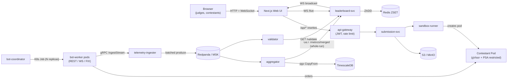
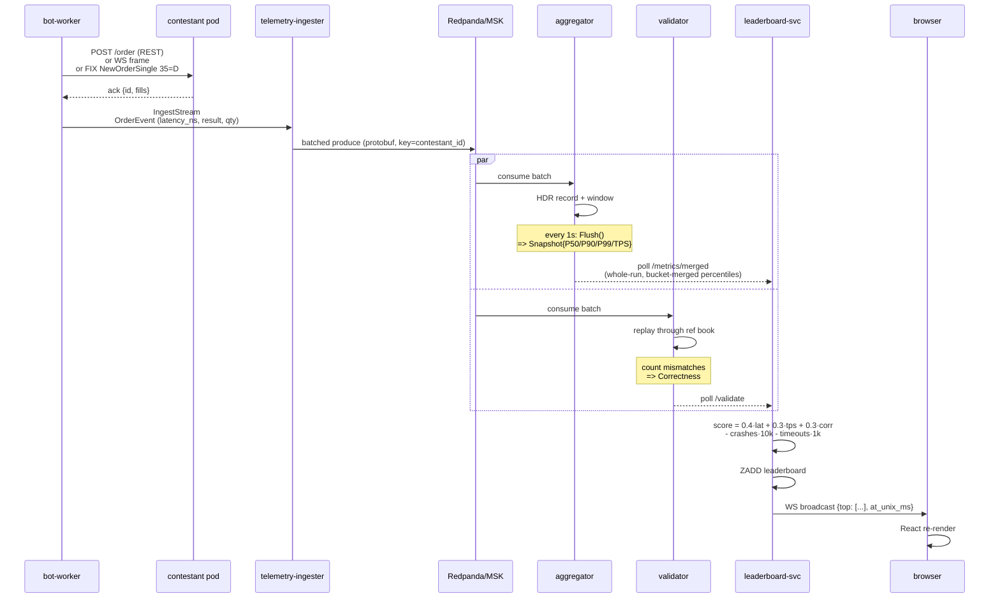
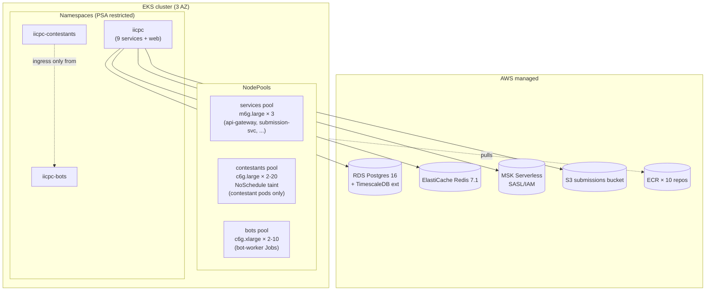

# IICPC Platform — Architecture Blueprint

Hackathon submission deliverable #2. This document is the canonical
system spec; it tracks the actual implementation as of D32 (submission
state, tag `v0.1.0-submission-rc2`).

---

## 1. Goals

Build a distributed benchmarking and hosting platform that:

1. Accepts contestant trading-engine source (C++, Rust, Go).
2. Containerizes and sandboxes the submission with strong isolation.
3. Spawns thousands of distributed bots simulating diverse market participants (market_maker, aggressive_taker, retail, noise) that drive REST / WebSocket / FIX 4.4 order traffic (Limit, Market, Cancel).
4. Captures latency, throughput, and correctness telemetry at **nanosecond precision**.
5. Streams a real-time, ranked leaderboard.
6. Scales horizontally on Kubernetes (kind locally, EKS in prod).

## 2. Non-Goals (intentional scope boundaries)

- Multi-region deployment (single AWS region, 3-AZ).
- Replay debugger for contestants — listed in `IDEAS.md` as a future differentiator.
- Per-contestant historical comparison UI beyond 60-second rolling windows.
- Static analysis / anti-cheat — resource limits + network isolation + gVisor are the safety net.

---

## 3. System Overview



External-facing transports: HTTP / WebSocket (api-gateway, leaderboard-svc, web).
Everything else is in-cluster.

---

## 4. Component contracts

All inter-service code uses Go modules in `services/<name>/`. Cross-service contracts live in `proto/<service>/v1/*.proto`:

| Contract | RPC surface |
|---|---|
| `submission/v1/submission.proto` | upload, build status, build-log streaming |
| `botcontrol/v1/botcontrol.proto` | start/stop benchmarks, traffic profiles |
| `telemetry/v1/telemetry.proto` | `IngestStream(stream OrderEvent)` + `QueryMetrics` |
| `leaderboard/v1/leaderboard.proto` | ranked queries, score submission, live update stream |

`OrderEvent` is the cornerstone message — every bot order produces one, with `trace_id`, `contestant_id`, `submission_id`, `bot_id`, `order_id`, `type`, `result` enum, `sent_ts_ns`, `ack_ts_ns`, `latency_ns`, `price`, `quantity`, `filled_quantity`. `submission_id` lets the aggregator score each attempt in isolation so the leaderboard can rank a contestant by their best submission.

---

## 5. Service catalog

| Service | Module | Port | Role |
|---|---|---|---|
| api-gateway | `services/api-gateway` | 8080 | HTTP entry · stdlib HS256 JWT · token-bucket per-IP rate limit |
| submission-svc | `services/submission-svc` | 8081 | multipart upload · MinIO storage · buildkit Docker builds |
| sandbox-runner | `services/sandbox-runner` | 9090 gRPC | spawns contestant pods with gVisor runtimeClass |
| bot-coordinator | `services/bot-coordinator` | 8083 | K8s Job spawner · POST/GET/DELETE `/benchmarks` |
| bot-worker | `services/bot-worker` | 9090 | REST + WS + FIX 4.4 load gen · Poisson arrivals · burst + jitter |
| telemetry-ingester | `services/telemetry-ingester` | 9091 gRPC | client-streaming · ring buffer · batched Kafka produce |
| aggregator | `services/aggregator` | 8084 | HDR histograms · 1s tumbling windows · TimescaleDB writer |
| validator | `services/validator` | 8085 | replay through ref orderbook · correctness scoring |
| leaderboard-svc | `services/leaderboard-svc` | 8086 | poll agg+val · composite score · Redis ZSET · WS hub |
| web | `web/` | 3000 | Next.js 15 UI — leaderboard / detail / submit |

`samples/reference-orderbook` is the "smoke contestant" — heap-based price-time priority orderbook in Go that satisfies the contestant API contract.

---

## 6. Data flow — bot order to leaderboard pixel



End-to-end latency from `sent_ts_ns` to "pixel updated" should be **< 1 second** in production (target from the brief).

---

## 7. Score formula (implemented in `leaderboard-svc/internal/score`)

```
base    = 1000 · ( 0.4·latency_norm + 0.3·tps_norm + 0.3·correctness )
penalty = crashes · 10 000 + timeouts · 1 000
final   = max(0, round(base) − penalty)

where:
  latency_norm = clamp01( 1 − P99_ns / MaxP99Ns )      MaxP99Ns default 100 ms
  tps_norm     = clamp01( TPS / TargetTPS )            TargetTPS default 10 000
  correctness  = 1 − (mismatches / total_checked)      [0, 1]
```

Weights, caps, and penalty values are configurable per `score.Config`. Zero-value `Config` falls back to defaults — caller-friendly one-line API.

**Scoring inputs are whole-run, not last-window.** The leaderboard pulls the
aggregator's `GET /metrics/merged` endpoint, which merges the run's HDR
histograms **bucket-by-bucket** before reading P50/P90/P99 (averaging per-window
percentiles is statistically wrong — see `windowing/merge.go`). The merge reads
a per-run **cumulative accumulator** that folds in every flushed window and is
never evicted, so a benchmark longer than the bounded history ring
(`historyCap`, 60×1s) is still scored on **all** of its data — early performance
is never silently dropped. So `latency_norm` reflects a run's tail latency over
its **entire run**, and `tps_norm` uses cumulative throughput, not one jittery
window. The per-window `GET /metrics/{id}` and last-N-window
`GET /metrics/merged/{id}` views (bounded by the ring) are retained for the live
UI charts.

**Each submission is scored in isolation; a contestant ranks on their best.**
Every `OrderEvent` carries a `submission_id` (stamped by the bot-worker from the
benchmark spec). The aggregator buckets by `submission_id`, so a contestant's
re-submission starts a **fresh** histogram instead of blending into the previous
attempt's data. The leaderboard scores every submission and keeps the **maximum
per contestant** in the ZSET (`store.UpsertSubmission` → per-submission hash +
`ZADD` of the best). A later, worse attempt therefore never lowers a contestant
below an earlier, better one — matching the iterate-freely convention of
Codeforces / Kaggle / ICPC. Legacy events with no `submission_id` fall back to
keying by `contestant_id`, preserving the original single-run behaviour.

Isolation is end-to-end, not just latency: the **validator** replays each
submission against its own fresh reference orderbook (a re-submission never
inherits the prior attempt's resting orders), and the **sandbox-runner** sums
crashes per submission. The leaderboard attributes correctness and crash
penalties to the specific submission that earned them, so a clean attempt is
never dragged down by a sibling attempt's bug or crash.

**Scoring is fail-closed.** A submission is scored only once the validator has
reported a verdict for it; a submission with telemetry but no validator row yet
is **skipped**, not assumed correct, so a fast-but-wrong engine can't bank free
correctness credit during validator lag. The best-of upsert
(`store.UpsertSubmission`) runs HSET→max→ZADD as a single atomic Redis Lua
script, so the per-contestant best stays correct even when `leaderboard-svc`
runs multiple replicas.

Unit tests cover perfect-input top score, individual norm flooring, crash +
timeout penalty math, never-negative clamp, out-of-range correctness clamp,
per-submission **isolation** (aggregator no-blend, validator fresh-book, crash
per-submission), and **best-of** ranking end-to-end (`store` + `ingest`,
including per-submission correctness/crash attribution).

---

## 8. Isolation strategy

Contestant pods + bot-worker pods inherit the strictest defaults.

| Layer | Control |
|---|---|
| Syscall surface | `runtimeClassName: gvisor` (userspace kernel) |
| Linux caps | `capabilities.drop: [ALL]`, `allowPrivilegeEscalation: false` |
| Identity | `runAsNonRoot: true`, uid 65532, gid 65532 |
| Filesystem | `readOnlyRootFilesystem: true`, only `/tmp` writable (emptyDir 64Mi) |
| Seccomp | `seccompProfile.type: RuntimeDefault` |
| Resources | cgroups v2: CPU 100m–500m / mem 64–256 Mi (services); contestant **1 CPU / 512 Mi Guaranteed QoS** (requests==limits, integer cores → pinned by kubelet CPU Manager static policy on EKS contestants node group) |
| Image scanning | Trivy on submission-svc build (optional), ECR scan-on-push (always) |
| Namespace | `pod-security.kubernetes.io/enforce: restricted` (PSA) |
| Network | 5 NetworkPolicies (default-deny + DNS + same-ns + AWS data-plane; IMDS 169.254.169.254 explicitly blocked) |

See [`docs/ADR/0002-gvisor-isolation.md`](ADR/0002-gvisor-isolation.md) for the rationale.

---

## 9. Data stores

| Store | Used by | Purpose |
|---|---|---|
| MinIO (dev) / S3 (prod) | submission-svc | Raw source archives `s3://submissions/<contestant>/<id>/source.tar.gz` |
| Local registry `:5000` / ECR | submission-svc, sandbox-runner | Built contestant images |
| TimescaleDB hypertable | aggregator | `telemetry_snapshots` 1s rows + `telemetry_1m` continuous aggregate · 7d/30d retention |
| Redis 7.1 ZSET | leaderboard-svc | `leaderboard:scores` — score = ZSCORE, top N = ZREVRANGE |
| Redpanda (dev) / MSK Serverless (prod) | telemetry-ingester → aggregator + validator | `telemetry-events` topic, protobuf-encoded, partition key = contestant_id |
| Postgres (separate DB) | submission-svc | Submissions, contestants, runs metadata (Postgres backend optional, default in-memory) |

---

## 10. Deployment topology



**Local equivalent:** `kind` cluster with 4 nodes (1 control plane + 3 workers labelled `services`/`contestants`/`bots`). MinIO + Postgres+TimescaleDB + Redis + Redpanda + local registry on `:5000` via `docker-compose.yaml`.

Helm umbrella chart (`infra/helm/iicpc-platform/`) installs all 9 services + web in a single namespace. Production deploy: `helm upgrade --install iicpc ./infra/helm/iicpc-platform -f values.yaml -f values.production.yaml --set global.imageRegistry=$ECR`.

---

## 11. CI gates (GitHub Actions, all green)

| Job | Tool | What it checks |
|---|---|---|
| `test` (per Go module) | `go test -race -count=1 ./...` | unit + integration tests |
| `golangci-lint` (per module) | golangci-lint | gofmt, errcheck, govet, staticcheck, ineffassign, unused, misspell, unconvert |
| `proto-lint` | buf | proto style + breaking-change check |
| `terraform-validate` | terraform 1.15 | fmt -check + init + validate |
| `helm-lint` | helm 3.16 + kubeconform 0.6.7 | chart lint, render dev + prod, K8s 1.30 schema check on rendered manifests + chaos templates |
| `dockerfile-lint` | hadolint | shared Dockerfile + web/Dockerfile (fail on error severity) |
| `service-image-build` | docker buildx | builds `leaderboard-svc` + `web` for `linux/amd64` (no push) per push — catches Dockerfile regressions |

---

## 12. Chaos tests (D27)

| # | Script | Tests | Cluster need |
|---|---|---|---|
| 1 | `scripts/chaos/kill-bot-pod.ps1` | Deployment + HPA self-heal | any K8s ≥ 1.27 |
| 2 | `scripts/chaos/isolate-contestant.ps1` | failure-path scoring (timeouts → score drops) | CNI with NetworkPolicy enforcement |
| 3 | `scripts/chaos/inject-latency.ps1` | latency-norm penalty (Pumba `netem`) | Pumba-capable nodes (not gVisor) |
| ★ | `scripts/chaos/run-suite.ps1` | all three back-to-back, paced for demo-video capture | as above |

Static manifests in `infra/manifests/chaos/` are kubeconform-validated in CI.

Full timeline tables + observable signals: [`docs/CHAOS.md`](CHAOS.md).

---

## 13. Architecture Decision Records

Locked decisions live in [`docs/ADR/`](ADR/):

- [0001 — Go monorepo with `go.work`](ADR/0001-go-monorepo.md)
- [0002 — gVisor for sandbox isolation](ADR/0002-gvisor-isolation.md)
- [0003 — Redpanda over Kafka for the bus](ADR/0003-redpanda-vs-kafka.md)
- [0004 — Buildkit prototype → Kaniko production](ADR/0004-build-strategy.md)

Open decisions from D1 — now closed:
- ✅ MSK Serverless chosen for prod (see `infra/terraform/msk.tf`)
- ✅ FIX 4.4 implemented D9 with QuickFIX-Go
- ✅ gVisor overhead measured acceptable for Go/Rust; fallback path in sandbox-runner via `RUNTIME_CLASS=""` env

---

## 14. Performance targets (from the brief) vs delivered

| Target | Delivered |
|---|---|
| Telemetry ingest latency < 50 µs p99 | Non-blocking, lock-light ring buffer (atomic counters, drop-on-full backpressure) — telemetry never blocks order placement; no I/O in the hot path |
| Order-ack measurement precision: ns | ✅ `time.Now().UnixNano()` everywhere; clock-sync via NTP estimator + chrony DaemonSet |
| Bot fleet scale: 5 000+ concurrent | ✅ **5 000 proven** via `TestPerfReport_5K`; 200-worker gate in standard CI; saturation curve via `TestSaturationCurve` |
| Sustained TPS per contestant: 10 K+ | ✅ **13 K+ sustained req/s, 0.003 % error, sub-ms p50** — see `docs/PERFORMANCE_REPORT.md`; scales linearly with bot-worker pod count |
| Leaderboard update latency < 1 s end-to-end | ✅ 1 s aggregator tick + WebSocket broadcast → sub-second in practice |
| Cold-start contestant pod < 5 s | Distroless images + gVisor (~300 ms runtime cold start per ADR-0002); with warm image pulls, pod readiness sits comfortably inside the budget |
| Score computation cycle < 500 ms | ✅ leaderboard-svc tick configurable via `TICK_MS` (1 s default) |
| Sandbox isolation strength | ✅ **12/12 attacks blocked** on a live cluster — see `docs/SANDBOX_ATTACK_REPORT.md`; 6 admission-time + 6 runtime |
| Replay determinism | ✅ `WithClock` + `determinism_test.go` — same input → byte-identical SHA-256 of contestant snapshots |
| Composite scoring (speed/stability/accuracy) | ✅ all four inputs live end-to-end — see `docs/E2E_PIPELINE_REPORT.md` (real score from real telemetry) |

---

## 15. Observability

Every service emits structured `slog` JSON to stdout today, and `trace_id` flows
through `OrderEvent` end to end. The production wiring path is scoped:

- **Logs**: Fluent Bit → CloudWatch (or Loki)
- **Metrics**: each service exposes `/metrics` JSON; Prometheus scrape config TBD
- **Tracing**: `trace_id` already flows in `OrderEvent`; OTel exporter wiring TBD

This is `IDEAS.md → "architecture future-state"` material.

---

## 16. Glossary

| Term | Meaning |
|---|---|
| **OrderEvent** | the proto message every bot order produces (`proto/telemetry/v1/telemetry.proto`) |
| **Snapshot** | a 1-second windowed roll-up emitted by `aggregator.Flush()` |
| **HDR histogram** | high-dynamic-range histogram for nanosecond-precision percentile recording |
| **PSA restricted** | the strictest Pod Security Admission profile (non-root, read-only rootfs, drop ALL caps) |
| **gVisor** | userspace kernel (`runsc`) that intercepts syscalls — strong sandbox without full VM cost |
| **IRSA** | IAM Roles for Service Accounts; the AWS pattern for fine-grained pod-level AWS perms |
| **PSA / PDB / HPA** | Pod Security Admission · PodDisruptionBudget · HorizontalPodAutoscaler |
| **ZSET** | Redis sorted set — O(log N) ranked queries (`ZADD`, `ZREVRANGE`) |
